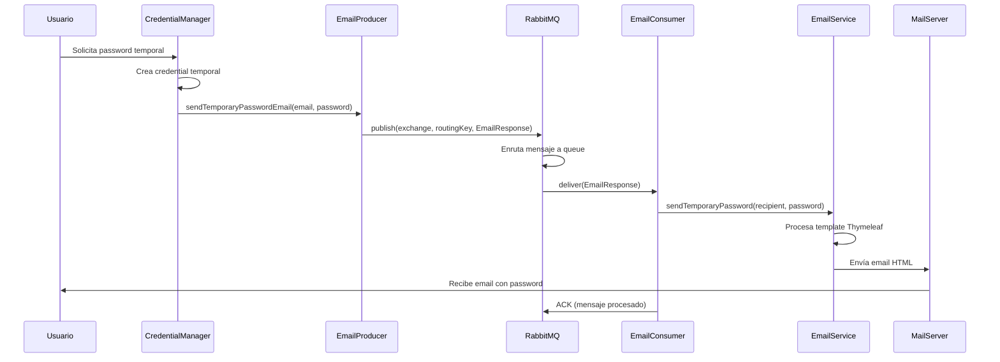

# Documentación Técnica

## Índice de Módulos

1. [Módulo DataSource](#módulo-datasource) - Gestión de Fuentes de Datos Externas
2. [Módulo Email - Event Driven Architecture](#módulo-email---event-driven-architecture) - Sistema de Mensajería Asíncrona

---

# Módulo DataSource
## Sistema de Marketing Digital - Gestión de Fuentes de Datos

### Índice
1. [Principios SOLID](#principios-solid)
2. [Patrones de Diseño](#patrones-de-diseño)
3. [Arquitectura](#arquitectura)
4. [Decisiones Técnicas](#decisiones-técnicas)

---

## Principios SOLID

### 1. Single Responsibility Principle (SRP)

**Definición:** Cada clase debe tener una única razón para cambiar, es decir, debe tener una sola responsabilidad.

**Implementación en el proyecto:**

```java
// DataSourceManager.java - Responsabilidad: Gestionar operaciones de DataSource
@Service
public class DataSourceManager {
    // Solo maneja operaciones CRUD y verificaciones de reglas de dominio
    public DataSource createDataSource(DataSourceRequestDTO dataSourceDto) { ... }
    public DataSource updateDataSource(Long id, DataSourceRequestDTO dataSourceDto) { ... }
    private void checkUniqueConstraints(DataSource dataSource, Long excludeId) { ... }
}

// DataSourceToResponseDtoConverter.java - Responsabilidad: Convertir DataSource a DTO de respuesta
@Component
public class DataSourceToResponseDtoConverter implements Converter<DataSource, DataSourceResponseDTO> {
    // Solo se encarga de convertir entidad a DTO de respuesta
    public DataSourceResponseDTO convert(MappingContext<DataSource, DataSourceResponseDTO> context) { ... }
}

// DataSourceRequestDtoToEntityConverter.java - Responsabilidad: Convertir DTO de request a entidad
@Component
public class DataSourceRequestDtoToEntityConverter implements Converter<DataSourceRequestDTO, DataSource> {
    // Solo se encarga de convertir DTO de request a entidad
    public DataSource convert(MappingContext<DataSourceRequestDTO, DataSource> context) { ... }
}
```

**Justificación:** Cada clase tiene una responsabilidad específica y bien definida:
- `DataSourceService`: Orquesta casos de uso
- `DataSourceManager`: Operaciones de repositorio y validaciones de dominio
- `DataSourceToResponseDtoConverter`: Transformación de entidad a DTO de respuesta
- `DataSourceRequestDtoToEntityConverter`: Transformación de DTO de request a entidad
- `DataSourceController`: Manejo de peticiones HTTP

### 2. Open/Closed Principle (OCP)

**Definición:** Las entidades de software deben estar abiertas para extensión, pero cerradas para modificación.

**Implementación en el proyecto:**

```java
// AuthenticationType.java - Extensible mediante enums
public enum AuthenticationType {
    NONE("No authentication required"),
    API_KEY("API Key authentication"),
    BEARER_TOKEN("Bearer token authentication"),
    BASIC_AUTH("Basic authentication");
    // Fácil agregar nuevos tipos sin modificar código existente
}

// Chain of Responsibility - Extensible agregando nuevos handlers
@Component
public class ApiKeyValidationHandler extends AbstractDataSourceValidationHandler {
    // Nuevo tipo de validación sin modificar código existente
    protected boolean canHandle(DataSourceRequestDTO dataSource) {
        return AuthenticationType.API_KEY.equals(dataSource.getAuthenticationType());
    }
}

// ResponseFormat.java - Extensible para nuevos formatos
public enum ResponseFormat {
    JSON("JavaScript Object Notation"),
    XML("eXtensible Markup Language"),
    CSV("Comma Separated Values");
    // Se pueden agregar nuevos formatos (YAML, etc.) sin cambiar el código
}
```

**Justificación:** El sistema está diseñado para soportar nuevos tipos de autenticación, validaciones y formatos de respuesta sin modificar el código existente, solo agregando nuevos valores a los enums o nuevos handlers a la cadena.

### 3. Liskov Substitution Principle (LSP)

**Implementación en el proyecto:**

```java
// DataSourceServiceImpl.java implementa DataSourceService
@Service
public class DataSourceServiceImpl extends BaseService implements DataSourceService {
    // Puede ser sustituida por cualquier implementación de DataSourceService
    // sin romper la funcionalidad
}

// DataSource extiende BaseEntity
@Entity
public class DataSource extends BaseEntity {
    // Puede ser usada donde se espere BaseEntity
    // Hereda auditoría y funcionalidad común
}

// Todos los handlers implementan la misma interfaz
public class BasicDataSourceValidationHandler extends AbstractDataSourceValidationHandler {
    // Cualquier handler puede ser sustituido por otro sin romper la cadena
}
```

**Justificación:** Las implementaciones pueden ser sustituidas por sus abstracciones sin alterar el comportamiento del sistema.

### 4. Interface Segregation Principle (ISP)

**Implementación en el proyecto:**

```java
// DataSourceService.java - Interfaz específica para DataSource
public interface DataSourceService {
    PagedResponse<DataSourceResponseDTO> search(...);
    DataSourceResponseDTO getDataSource(Long id);
    DataSourceResponseDTO createDataSource(DataSourceRequestDTO request);
    DataSourceResponseDTO updateDataSource(Long id, DataSourceRequestDTO request);
    void deleteDataSource(Long id);
}

// DataSourceValidationHandler.java - Interfaz específica para validaciones
public interface DataSourceValidationHandler {
    void validate(DataSourceRequestDTO dataSource) throws DataCollectionException;
    void setNext(DataSourceValidationHandler next);
}
```

**Justificación:** Cada servicio tiene su propia interfaz con métodos específicos a su dominio, evitando interfaces "grandes" que fuercen a implementar métodos innecesarios.

### 5. Dependency Inversion Principle (DIP)

**Implementación en el proyecto:**

```java
// DataSourceServiceImpl depende de abstracciones, no de concreciones
@Service
public class DataSourceServiceImpl implements DataSourceService {
    private final DataSourceManager dataSourceManager;  // Abstracción
    
    // Constructor injection - Inversión de dependencias
    public DataSourceServiceImpl(DataSourceManager manager) {
        this.dataSourceManager = manager;
    }
}

// DataSourceManager depende de abstracciones
@Service
public class DataSourceManager {
    private final DataSourceValidationChainFactory validationChainFactory; // Abstracción
    private final DataSourceRepository dataSourceRepository; // Abstracción
    
    // Spring IoC resuelve las dependencias automáticamente
}
```

**Justificación:** Las clases de alto nivel no dependen de clases de bajo nivel, ambas dependen de abstracciones mediante inyección de dependencias.

---

## Patrones de Diseño

### 1. Repository Pattern

**Motivación:** Encapsular la lógica de acceso a datos y proporcionar una interfaz más orientada a objetos para acceder a los datos.

**Implementación:**
```java
@Repository
public interface DataSourceRepository extends BaseRepository<DataSource, Long> {
    Page<DataSource> search(String searchText, Pageable pageable);
    List<DataSource> findByActiveAndDeleted(Boolean active, Boolean deleted);
    Optional<DataSource> findByNameAndDeleted(String name, Boolean deleted);
}
```

**Justificación:** Abstrae el acceso a datos, permite testing con mocks y centraliza queries específicas del dominio.

### 2. Data Transfer Object (DTO) Pattern

**Motivación:** Transferir datos entre capas sin exponer la estructura interna de las entidades.

**Implementación:**
```java
// Request DTO - Solo datos necesarios para crear/actualizar
public class DataSourceRequestDTO {
    private String name;
    private String url;
    private ResponseFormat format;
    private List<FieldMappingDTO> fieldMappings;
}

// Response DTO - Datos seguros para exponer al cliente
public class DataSourceResponseDTO extends BaseDTO {
    private String name;
    private String url;
    private Boolean active;
    // NO incluye información sensible como passwords
}
```

**Justificación:** Separa la representación interna de la externa, permitiendo evolución independiente y control sobre qué datos se exponen.

### 3. Converter Pattern con Autodescubrimiento

**Motivación:** Centralizar la lógica de conversión entre DTOs y entidades utilizando el autodescubrimiento de Spring para registrar converters automáticamente.

**Implementación:**
```java
// Converter autodescubrible para request DTO a entidad
@Component
public class DataSourceRequestDtoToEntityConverter implements Converter<DataSourceRequestDTO, DataSource> {
    @Override
    public DataSource convert(MappingContext<DataSourceRequestDTO, DataSource> context) {
        DataSourceRequestDTO source = context.getSource();
        DataSource destination = context.getDestination();
        
        // Mapeo personalizado con manejo de relaciones bidireccionales
        if (source.getFieldMappings() != null) {
            List<FieldMapping> fieldMappings = source.getFieldMappings().stream()
                .map(fieldMappingDTO -> {
                    FieldMapping fieldMapping = modelMapper.map(fieldMappingDTO, FieldMapping.class);
                    fieldMapping.setDataSource(destination);
                    return fieldMapping;
                })
                .collect(Collectors.toList());
            destination.getFieldMappings().addAll(fieldMappings);
        }
        return destination;
    }
}

// Converter autodescubrible para entidad a response DTO
@Component
public class DataSourceToResponseDtoConverter implements Converter<DataSource, DataSourceResponseDTO> {
    @Override
    public DataSourceResponseDTO convert(MappingContext<DataSource, DataSourceResponseDTO> context) {
        // Conversión específica con manejo seguro de datos sensibles
        DataSource source = context.getSource();
        DataSourceResponseDTO destination = context.getDestination();
        
        // Solo exponer datos seguros
        destination.setActive(source.getActive());
        // NO exponer credenciales o información sensible
        
        return destination;
    }
}
```

**Justificación:** Spring IoC Container autodescubre los Converters anotados con `@Component` y los registra en ModelMapper automáticamente. Esto elimina la necesidad de imports manuales y centraliza las transformaciones complejas con manejo seguro de relaciones bidireccionales.

### 4. Chain of Responsibility Pattern

**Motivación:** Desacoplar las validaciones del Manager y hacer el sistema de validaciones extensible sin modificar código existente.

**Implementación:**
```java
// Handler abstracto que define la estructura de la cadena
public abstract class AbstractDataSourceValidationHandler implements DataSourceValidationHandler {
    private DataSourceValidationHandler next;
    
    @Override
    public void validate(DataSourceRequestDTO dataSource) throws DataCollectionException {
        if (canHandle(dataSource)) {
            doValidate(dataSource);
        }
        if (next != null) {
            next.validate(dataSource);
        }
    }
    
    protected abstract boolean canHandle(DataSourceRequestDTO dataSource);
    protected abstract void doValidate(DataSourceRequestDTO dataSource) throws DataCollectionException;
    
    @Override
    public void setNext(DataSourceValidationHandler next) {
        this.next = next;
    }
}

// Validador específico para validaciones básicas
@Component
public class BasicDataSourceValidationHandler extends AbstractDataSourceValidationHandler {
    @Override
    protected boolean canHandle(DataSourceRequestDTO dataSource) {
        return true; // Siempre aplica validaciones básicas
    }
    
    @Override
    protected void doValidate(DataSourceRequestDTO dataSource) throws DataCollectionException {
        // Validar URL, nombre, etc.
        validateUrl(dataSource.getUrl());
        validateName(dataSource.getName());
    }
}

// Validador específico para API Key
@Component
public class ApiKeyValidationHandler extends AbstractDataSourceValidationHandler {
    @Override
    protected boolean canHandle(DataSourceRequestDTO dataSource) {
        return AuthenticationType.API_KEY.equals(dataSource.getAuthenticationType());
    }
    
    @Override
    protected void doValidate(DataSourceRequestDTO dataSource) throws DataCollectionException {
        // Validaciones específicas para API Key
        if (StringUtils.isBlank(dataSource.getApiKey())) {
            throw new DataCollectionException(
                messageUtil.getMessage("datasource.validation.apikey.required"),
                ErrorCodeResponse.BUSINESS_ERROR
            );
        }
    }
}

// Factory para construir la cadena de validaciones
@Component
@RequiredArgsConstructor
public class DataSourceValidationChainFactory {
    private final BasicDataSourceValidationHandler basicHandler;
    private final ApiKeyValidationHandler apiKeyHandler;
    private final BasicAuthValidationHandler basicAuthHandler;
    private final BearerTokenValidationHandler bearerTokenHandler;
    
    public DataSourceValidationHandler createValidationChain() {
        // Construir cadena: Basic -> ApiKey -> BasicAuth -> BearerToken
        basicHandler.setNext(apiKeyHandler);
        apiKeyHandler.setNext(basicAuthHandler);
        basicAuthHandler.setNext(bearerTokenHandler);
        
        return basicHandler;
    }
}
```

**Justificación:** Cada validador maneja un aspecto específico de la validación, permitiendo:
- **Extensibilidad:** Agregar nuevos tipos de validación sin modificar código existente
- **Composición flexible:** Diferentes cadenas para diferentes escenarios
- **Responsabilidad única:** Cada handler tiene una sola razón para cambiar
- **Testing independiente:** Cada validador puede ser testeado por separado

### 5. Facade Pattern

**Motivación:** Proporcionar una interfaz simplificada para operaciones complejas del subsistema.

**Implementación:**
```java
@Service
public class DataSourceManager {
    // Facade que combina validación + conversión + persistencia + verificación de restricciones
    public DataSource createDataSource(DataSourceRequestDTO dataSourceDto) throws DataCollectionException {
        // 1. Validar con Chain of Responsibility
        validationChainFactory.createValidationChain().validate(dataSourceDto);
        
        // 2. Convertir DTO a entidad con ModelMapper autodescubrible
        DataSource dataSource = modelMapper.map(dataSourceDto, DataSource.class);
        
        // 3. Verificar restricciones de dominio
        checkUniqueConstraints(dataSource, null);
        
        // 4. Persistir
        return dataSourceRepository.save(dataSource);
    }
}
```

**Justificación:** Simplifica operaciones complejas combinando múltiples pasos (validación, conversión, reglas de dominio, persistencia) en una sola interfaz coherente.

### 6. Exception Handling Pattern

**Motivación:** Manejo centralizado y consistente de errores.

**Implementación:**
```java
// Excepción específica del dominio
public class DataCollectionException extends RuntimeException {
    private final ErrorCodeResponse errorCode;
    
    public DataCollectionException(String message, ErrorCodeResponse errorCode) {
        super(message);
        this.errorCode = errorCode;
    }
}

// Manejo centralizado
@RestControllerAdvice
public class RestControllerExceptionHandler {
    @ExceptionHandler(Exception.class)
    public ResponseEntity<ApiResponseErrorDTO> handleException(Exception e) {
        if (e instanceof DataCollectionException dataCollectionException) {
            // Manejo específico con logging y códigos de error
            log.error("Error en recolección de datos: {}", dataCollectionException.getMessage());
            // ... crear respuesta apropiada
        }
    }
}
```

**Justificación:** Centraliza el manejo de errores, proporciona códigos semánticos y evita duplicación en controllers.

---

## Arquitectura

### Patrón: Layered Architecture + RESTful Services

**Justificación de la elección:**

1. **Separación de responsabilidades:** Cada capa tiene una responsabilidad específica
2. **Mantenibilidad:** Cambios en una capa no afectan otras
3. **Testabilidad:** Cada capa puede ser testeada independientemente
4. **Escalabilidad:** Permite evolución independiente de cada capa

**Estructura implementada:**

```
┌─────────────────────────────────────┐
│           Controller Layer          │ ← HTTP/REST interface
├─────────────────────────────────────┤
│            Service Layer            │ ← Business orchestration
├─────────────────────────────────────┤
│            Manager Layer            │ ← Domain operations facade
├─────────────────────────────────────┤
│          Repository Layer           │ ← Data access abstraction
├─────────────────────────────────────┤
│            Entity Layer             │ ← Domain model
└─────────────────────────────────────┘
```

**Flujo de datos:**
1. **Controller** recibe HTTP request
2. **Service** orquesta el caso de uso
3. **Manager** ejecuta operaciones de dominio con validaciones
4. **Repository** persiste/recupera datos
5. **Converters** transforman entre DTOs y entidades automáticamente

### Ejemplo de Implementación del Flujo:

```java
// 1. Controller - Punto de entrada HTTP
@PostMapping
@RequiresPermission({PermissionsEnum.SUPERADMIN})
public ResponseEntity<DataSourceResponseDTO> createDataSource(
    @RequestBody DataSourceRequestDTO request
) throws DataCollectionException {
    DataSourceResponseDTO response = dataSourceService.createDataSource(request);
    return ResponseEntity.status(HttpStatus.CREATED).body(response);
}

// 2. Service - Orquestación del caso de uso
@Override
@Transactional
public DataSourceResponseDTO createDataSource(DataSourceRequestDTO request) {
    DataSource savedDataSource = dataSourceManager.createDataSource(request); // Lógica de negocio
    return this.convertToDto(savedDataSource, DataSourceResponseDTO.class);     // Conversión automática
}

// 3. Manager - Operaciones de dominio con validaciones
public DataSource createDataSource(DataSourceRequestDTO dataSourceDto) throws DataCollectionException {
    // Validar con Chain of Responsibility
    validationChainFactory.createValidationChain().validate(dataSourceDto);
    
    // Convertir DTO a entidad con ModelMapper autodescubrible
    DataSource dataSource = modelMapper.map(dataSourceDto, DataSource.class);
    
    // Verificar restricciones de dominio
    checkUniqueConstraints(dataSource, null);
    
    return dataSourceRepository.save(dataSource);
}
```

---

## Decisiones Técnicas

### 1. Gestión de Relaciones Bidireccionales

**Decisión:** Manejo automático en Converters con ModelMapper

**Implementación:**
```java
// En DataSourceRequestDtoToEntityConverter
@Override
public DataSource convert(MappingContext<DataSourceRequestDTO, DataSource> context) {
    DataSourceRequestDTO source = context.getSource();
    DataSource destination = context.getDestination();
    
    if (source.getFieldMappings() != null) {
        List<FieldMapping> fieldMappings = source.getFieldMappings().stream()
            .map(fieldMappingDTO -> {
                FieldMapping fieldMapping = modelMapper.map(fieldMappingDTO, FieldMapping.class);
                fieldMapping.setDataSource(destination); // Establecer relación bidireccional
                return fieldMapping;
            })
            .collect(Collectors.toList());
        destination.getFieldMappings().addAll(fieldMappings);
    }
    return destination;
}
```

**Justificación:** Los Converters autodescubribles manejan las relaciones bidireccionales de forma centralizada, asegurando consistencia y evitando problemas de sincronización.

### 2. Validaciones de Dominio con Chain of Responsibility

**Decisión:** Validaciones desacopladas y extensibles mediante patrones

**Implementación:**
```java
// En DataSourceManager
public DataSource createDataSource(DataSourceRequestDTO dataSourceDto) throws DataCollectionException {
    // Validar con cadena de validaciones extensible
    validationChainFactory.createValidationChain().validate(dataSourceDto);
    // ... resto de la lógica
}

// Validadores específicos por tipo de autenticación
@Component
public class BasicDataSourceValidationHandler extends AbstractDataSourceValidationHandler {
    @Override
    protected void doValidate(DataSourceRequestDTO dataSource) throws DataCollectionException {
        validateUrl(dataSource.getUrl());
        validateName(dataSource.getName());
    }
}
```

**Justificación:** El patrón Chain of Responsibility permite agregar nuevos tipos de validación sin modificar código existente, siguiendo el principio Open/Closed.

### 3. Autodescubrimiento de Converters

**Decisión:** Uso de Spring IoC para registro automático de converters

**Implementación:**
```java
// Converters autodescubribles con @Component
@Component
public class DataSourceToResponseDtoConverter implements Converter<DataSource, DataSourceResponseDTO> {
    // Spring automáticamente registra este converter en ModelMapper
}

// En BaseService: uso transparente
protected <T> T convertToDto(Object source, Class<T> destinationType) {
    return modelMapper.map(source, destinationType);
}
```

**Justificación:** Elimina imports manuales, reduce acoplamiento y permite que Spring gestione automáticamente el registro de converters en ModelMapper.

### 4. Internacionalización

**Decisión:** Mensajes centralizados con i18n

**Implementación:**
```properties
# messages_es.properties
datasource.not.found=La fuente de datos no existe.
datasource.validation.url.invalid=La URL no es válida.
datasource.validation.apikey.required=La clave API es requerida.

# messages_en.properties  
datasource.not.found=Data source not found.
datasource.validation.url.invalid=URL is invalid.
datasource.validation.apikey.required=API key is required.
```

**Justificación:** Permite soporte multi-idioma y centraliza todos los mensajes del sistema para fácil mantenimiento.

### 5. Seguridad y Autorización

**Decisión:** Solo SUPERADMIN puede gestionar DataSources

**Implementación:**
```java
@GetMapping
@RequiresPermission({PermissionsEnum.SUPERADMIN})
public PagedResponse<DataSourceResponseDTO> search(...) {
    // Solo usuarios con rol SUPERADMIN pueden acceder
}
```

**Justificación:** Los DataSources son configuraciones críticas del sistema que solo deben ser gestionadas por usuarios con máximos privilegios.

### 6. Transaccionalidad

**Decisión:** Transacciones a nivel de Service

**Implementación:**
```java
@Override
@Transactional
public DataSourceResponseDTO createDataSource(DataSourceRequestDTO request) {
    // Toda la operación es atómica
}

@Override
@Transactional(readOnly = true)
public PagedResponse<DataSourceResponseDTO> search(...) {
    // Operaciones de solo lectura optimizadas
}
```

**Justificación:** Garantiza consistencia de datos y permite rollback automático en caso de errores, especialmente importante al manejar relaciones con FieldMappings y validaciones complejas.

---

## Conclusión

La implementación del módulo DataSource sigue principios sólidos de ingeniería de software:

- **SOLID principles** aseguran mantenibilidad y extensibilidad
- **Chain of Responsibility** para validaciones desacopladas y extensibles
- **Converter Pattern con Autodiscovery** para transformaciones transparentes y automáticas
- **DTO-first approach** en capas de negocio
- **BaseService pattern** para reutilización de conversiones
- **Layered architecture** garantiza separación de responsabilidades
- **Error handling** centralizado mejora la experiencia del usuario

Esta arquitectura proporciona una base **sólida, extensible y mantenible** para las siguientes fases del sistema de recolección de datos.

---

# Módulo Email - Event Driven Architecture
## Sistema de Marketing Digital - Mensajería Asíncrona con RabbitMQ

### Índice
1. [¿Qué es Event Driven Architecture?](#qué-es-event-driven-architecture)
2. [Principios SOLID](#principios-solid-email)
3. [Patrones de Diseño](#patrones-de-diseño-email)
4. [Arquitectura Event Driven](#arquitectura-event-driven)
5. [Componentes del Sistema](#componentes-del-sistema)
6. [Flujo de Eventos](#flujo-de-eventos)
7. [Decisiones Técnicas](#decisiones-técnicas-email)

---

## ¿Qué es Event Driven Architecture?

**Event Driven Architecture (EDA)** es un patrón arquitectónico donde los componentes del sistema se comunican a través de la producción y consumo de eventos. **En esta caso, usar RabbitMQ definitivamente se considera Event Driven Architecture**.

### Beneficios implementados en nuestro sistema:

1. **Desacoplamiento:** Los productores de eventos no conocen a los consumidores
2. **Asincronía:** Las operaciones no bloquean el hilo principal
3. **Escalabilidad:** Múltiples consumidores pueden procesar eventos en paralelo
4. **Resiliencia:** Los mensajes persisten hasta ser procesados exitosamente
5. **Flexibilidad:** Fácil agregar nuevos tipos de eventos y consumidores

### Caso de Uso Principal: Sistema de Emails

Cuando un usuario se registra, requiere recuperación de contraseña o verificación de cuenta, el sistema:

1. **Publica un evento** (EmailProducer → RabbitMQ)
2. **Procesa asíncronamente** (EmailConsumer)
3. **Envía email templated** (EmailService + Thymeleaf)

---

## Principios SOLID {#principios-solid-email}

### 1. Single Responsibility Principle (SRP)

**Implementación en el proyecto:**

```java
// EmailProducer.java - Responsabilidad: Publicar eventos de email
@Service
public class EmailProducer {
    // Solo se encarga de publicar mensajes a RabbitMQ
    public void sendTemporaryPasswordEmail(String destinatary, String temporaryPassword) {
        EmailResponse message = new EmailResponse(destinatary, temporaryPassword);
        rabbitTemplate.convertAndSend(RabbitMQConstants.EMAIL_TEMPORARY_PASSWORD_EXCHANGE,
                                      RabbitMQConstants.EMAIL_TEMPORARY_PASSWORD_ROUTING_KEY,
                                      message);
    }
}

// EmailConsumer.java - Responsabilidad: Consumir eventos y delegar
@Service
public class EmailConsumer {
    // Solo se encarga de recibir mensajes y delegar al EmailService
    @RabbitListener(queues = RabbitMQConstants.EMAIL_TEMPORARY_PASSWORD_QUEUE)
    public void processTemporaryPassword(EmailResponse message, Channel channel, @Header(AmqpHeaders.DELIVERY_TAG) long tag) {
        try {
            emailService.sendTemporaryPassword(message.getRecipient(), message.getMessage());
            channel.basicAck(tag, false);
        } catch (Exception e) {
            channel.basicNack(tag, false, true);
            throw e;
        }
    }
}

// EmailServiceImpl.java - Responsabilidad: Envío real de emails con templates
@Service
public class EmailServiceImpl implements EmailService {
    // Solo se encarga de enviar emails usando templates Thymeleaf
    public void sendTemporaryPassword(String destinatary, String temporaryPassword) throws MessagingException {
        Context context = new Context();
        context.setVariables(Map.of("nombre", destinatary, "password", temporaryPassword));
        String htmlContent = templateEngine.process("email-password", context);
        // ... configurar y enviar email
    }
}
```

### 2. Open/Closed Principle (OCP)

**Implementación:**

```java
// Extensible para nuevos tipos de emails sin modificar código existente
public class EmailProducer {
    // Métodos existentes: sendTemporaryPasswordEmail, sendVerificationCodeEmail, sendRecoveryAccountEmail
    
    // Fácil agregar nuevos tipos:
    // public void sendWelcomeEmail(String destinatary, String welcomeData) { ... }
    // public void sendPasswordChangedEmail(String destinatary) { ... }
}

// EmailConsumer extensible con nuevos @RabbitListener
@Service
public class EmailConsumer {
    // Listeners existentes para password, verification, recovery
    
    // Fácil agregar nuevos consumers:
    // @RabbitListener(queues = "email.welcome.queue")
    // public void processWelcomeEmail(EmailResponse message...) { ... }
}
```

### 3. Liskov Substitution Principle (LSP)

```java
// EmailService puede ser sustituido por cualquier implementación
public interface EmailService {
    void sendTemporaryPassword(String destinatary, String temporaryPassword);
    void sendVerificationCode(String destinatary, String verificationCode);
    void sendRecoveryAccount(String destinatary, String verificationCode);
}

// Implementaciones intercambiables
@Service
public class EmailServiceImpl implements EmailService { /* Implementación con JavaMailSender */ }

// Posibles futuras implementaciones:
// public class SendGridEmailService implements EmailService { /* Implementación con SendGrid API */ }
// public class MockEmailService implements EmailService { /* Para testing */ }
```

### 4. Interface Segregation Principle (ISP)

```java
// EmailService - Interfaz específica para envío de emails
public interface EmailService {
    void sendTemporaryPassword(String destinatary, String temporaryPassword);
    void sendVerificationCode(String destinatary, String verificationCode);
    void sendRecoveryAccount(String destinatary, String verificationCode);
    // No incluye métodos de otras responsabilidades
}

// EmailProducer - Clase específica para publicación de eventos
@Service
public class EmailProducer {
    // Solo métodos de publicación, no de consumo o configuración
}
```

### 5. Dependency Inversion Principle (DIP)

```java
// EmailConsumer depende de abstracción EmailService, no de implementación
@Service
public class EmailConsumer {
    private final EmailService emailService; // Abstracción
    
    public EmailConsumer(EmailService emailService) {
        this.emailService = emailService; // Spring IoC inyecta la implementación
    }
}

// CredentialManager depende de abstracción EmailProducer
@Service
public class CredentialManager {
    private final EmailProducer emailProducer; // Abstracción
    
    // Spring resuelve dependencias automáticamente
}
```

---

## Patrones de Diseño {#patrones-de-diseño-email}

### 1. Publisher-Subscriber Pattern (Event Driven)

**Motivación:** Desacoplar la generación de eventos del procesamiento de los mismos.

**Implementación:**
```java
// Publisher - EmailProducer
@Service
public class EmailProducer {
    private final RabbitTemplate rabbitTemplate;
    
    // Evento: Password temporal creado
    public void sendTemporaryPasswordEmail(String destinatary, String temporaryPassword) {
        EmailResponse message = new EmailResponse(destinatary, temporaryPassword);
        rabbitTemplate.convertAndSend(
            RabbitMQConstants.EMAIL_TEMPORARY_PASSWORD_EXCHANGE,
            RabbitMQConstants.EMAIL_TEMPORARY_PASSWORD_ROUTING_KEY,
            message
        );
    }
    
    // Evento: Código de verificación generado
    public void sendVerificationCodeEmail(String destinatary, String verificationCode) {
        EmailResponse message = new EmailResponse(destinatary, verificationCode);
        rabbitTemplate.convertAndSend(
            RabbitMQConstants.EMAIL_VERIFICATION_CODE_EXCHANGE,
            RabbitMQConstants.EMAIL_VERIFICATION_CODE_ROUTING_KEY,
            message
        );
    }
    
    // Evento: Recuperación de cuenta solicitada
    public void sendRecoveryAccountEmail(String destinatary, String verificationCode) {
        EmailResponse message = new EmailResponse(destinatary, verificationCode);
        rabbitTemplate.convertAndSend(
            RabbitMQConstants.EMAIL_RECOVERY_ACCOUNT_EXCHANGE,
            RabbitMQConstants.EMAIL_RECOVERY_ACCOUNT_ROUTING_KEY,
            message
        );
    }
}
```

**Justificación:** El CredentialManager puede crear credentials sin preocuparse por el envío de emails. El sistema de emails funciona independientemente y puede escalarse por separado.

### 2. Template Method Pattern

**Motivación:** Definir estructura común para envío de emails con variaciones específicas por tipo.

**Implementación:**
```java
@Service
public class EmailServiceImpl implements EmailService {
    
    @Override
    public void sendTemporaryPassword(String destinatary, String temporaryPassword) throws MessagingException {
        sendTemplatedEmail(
            destinatary,
            "email-password",                                    // Template específico
            Map.of("nombre", destinatary, "password", temporaryPassword), // Variables específicas
            "email.password.temporary"                           // Subject específico
        );
    }
    
    @Override
    public void sendVerificationCode(String destination, String verificationCode) throws MessagingException {
        sendTemplatedEmail(
            destination,
            "email-verification",                                // Template específico
            Map.of("nombre", destination, "codigo", verificationCode), // Variables específicas
            "email.code.verification"                            // Subject específico
        );
    }
    
    // Template method común
    private void sendTemplatedEmail(String destinatary, String template, Map<String, Object> variables, String subjectKey) throws MessagingException {
        MimeMessage message = javaMailSender.createMimeMessage();
        MimeMessageHelper helper = new MimeMessageHelper(message, true, ENCODING);
        
        Context context = new Context();
        context.setVariables(variables);
        String htmlContent = templateEngine.process(template, context);
        
        helper.setTo(destinatary);
        helper.setSubject(messageUtil.getMessage(subjectKey));
        helper.setText(htmlContent, true);
        
        javaMailSender.send(message);
    }
}
```

**Justificación:** Reutiliza la lógica común de creación y envío de emails, variando solo template, variables y subject por tipo de email.

### 3. Message Queue Pattern

**Motivación:** Garantizar entrega confiable y procesamiento asíncrono de mensajes.

**Implementación:**
```java
// Configuración de infraestructura de mensajería
@Configuration
public class RabbitMQConfig {
    
    // Exchanges - Puntos de entrada para mensajes
    @Bean
    public TopicExchange emailTemporaryPasswordExchange() {
        return new TopicExchange(RabbitMQConstants.EMAIL_TEMPORARY_PASSWORD_EXCHANGE);
    }
    
    // Queues - Almacenamiento persistente de mensajes
    @Bean
    public Queue emailTemporaryPasswordQueue() {
        return new Queue(RabbitMQConstants.EMAIL_TEMPORARY_PASSWORD_QUEUE, true); // Durable = true
    }
    
    // Bindings - Ruteo de mensajes
    @Bean
    public Binding bindingTemporaryPassword(Queue emailTemporaryPasswordQueue, TopicExchange emailTemporaryPasswordExchange) {
        return BindingBuilder
                .bind(emailTemporaryPasswordQueue)
                .to(emailTemporaryPasswordExchange)
                .with(RabbitMQConstants.EMAIL_TEMPORARY_PASSWORD_ROUTING_KEY);
    }
    
    // Configuración de acknowledgments manuales para confiabilidad
    @Bean
    public SimpleRabbitListenerContainerFactory rabbitListenerContainerFactory(ConnectionFactory connectionFactory, RabbitMQErrorHandler rabbitMQErrorHandler) {
        SimpleRabbitListenerContainerFactory factory = new SimpleRabbitListenerContainerFactory();
        factory.setAcknowledgeMode(AcknowledgeMode.MANUAL); // Manual ACK/NACK
        factory.setDefaultRequeueRejected(true);           // Reintento en errores
        factory.setErrorHandler(rabbitMQErrorHandler);     // Manejo de errores
        return factory;
    }
}
```

**Justificación:** Garantiza que los emails no se pierdan, permite reintentos automáticos y escalabilidad horizontal de consumidores.

### 4. Data Transfer Object (DTO) Pattern

**Motivación:** Estructura estándar para mensajes entre producer y consumer.

**Implementación:**
```java
@Data
@AllArgsConstructor
@NoArgsConstructor
public class EmailResponse {
    private String recipient;  // Destinatario del email
    private String message;    // Contenido/código/password del email
}
```

**Justificación:** Proporciona estructura consistente para todos los tipos de emails, facilita serialización/deserialización JSON y evolución independiente del mensaje.

### 5. Dependency Injection Pattern

**Motivación:** Desacoplamiento de dependencias mediante inversión de control.

**Implementación:**
```java
// EmailConsumer recibe EmailService mediante constructor injection
@Service
@RequiredArgsConstructor  // Lombok genera constructor con dependencias final
public class EmailConsumer {
    private final EmailService emailService;
    
    // Spring IoC resuelve EmailService automáticamente
}

// EmailServiceImpl recibe sus dependencias
@Service
@RequiredArgsConstructor
public class EmailServiceImpl implements EmailService {
    private final JavaMailSender javaMailSender;
    private final MessageUtil messageUtil;
    private final SpringTemplateEngine templateEngine;
    
    // Spring IoC resuelve todas las dependencias
}
```

**Justificación:** Facilita testing con mocks, permite cambiar implementaciones sin modificar código y Spring gestiona el ciclo de vida de los beans automáticamente.

---

## Arquitectura Event Driven

### Patrón: Event Driven Architecture + Message Queue + Template Engine

**Justificación de la elección:**

1. **Desacoplamiento temporal:** Los emails se procesan asincrónamente
2. **Confiabilidad:** RabbitMQ garantiza entrega de mensajes
3. **Escalabilidad:** Múltiples workers pueden procesar emails
4. **Resiliencia:** Reintentos automáticos en caso de fallo
5. **Separación de responsabilidades:** Lógica de negocio vs envío de emails

**Estructura implementada:**

```
┌─────────────────────────────────────┐
│        Business Logic Layer        │ ← CredentialManager, AuthService
├─────────────────────────────────────┤
│         Event Producer Layer       │ ← EmailProducer (publica eventos)
├─────────────────────────────────────┤
│       Message Broker Layer         │ ← RabbitMQ (exchanges, queues, routing)
├─────────────────────────────────────┤
│        Event Consumer Layer        │ ← EmailConsumer (consume eventos)
├─────────────────────────────────────┤
│       Email Service Layer          │ ← EmailService (templates + envío)
├─────────────────────────────────────┤
│     Template & Transport Layer     │ ← Thymeleaf + JavaMailSender
└─────────────────────────────────────┘
```

---

## Componentes del Sistema

### 1. Event Producers (Publicadores)

```java
// EmailProducer - Punto de entrada para eventos de email
@Service
public class EmailProducer {
    private final RabbitTemplate rabbitTemplate;
    
    // Evento: Password temporal creado
    public void sendTemporaryPasswordEmail(String destinatary, String temporaryPassword) {
        EmailResponse message = new EmailResponse(destinatary, temporaryPassword);
        rabbitTemplate.convertAndSend(
            RabbitMQConstants.EMAIL_TEMPORARY_PASSWORD_EXCHANGE,
            RabbitMQConstants.EMAIL_TEMPORARY_PASSWORD_ROUTING_KEY,
            message
        );
    }
    
    // Evento: Código de verificación generado
    public void sendVerificationCodeEmail(String destinatary, String verificationCode) {
        EmailResponse message = new EmailResponse(destinatary, verificationCode);
        rabbitTemplate.convertAndSend(
            RabbitMQConstants.EMAIL_VERIFICATION_CODE_EXCHANGE,
            RabbitMQConstants.EMAIL_VERIFICATION_CODE_ROUTING_KEY,
            message
        );
    }
    
    // Evento: Recuperación de cuenta solicitada
    public void sendRecoveryAccountEmail(String destinatary, String verificationCode) {
        EmailResponse message = new EmailResponse(destinatary, verificationCode);
        rabbitTemplate.convertAndSend(
            RabbitMQConstants.EMAIL_RECOVERY_ACCOUNT_EXCHANGE,
            RabbitMQConstants.EMAIL_RECOVERY_ACCOUNT_ROUTING_KEY,
            message
        );
    }
}
```

### 2. Message Broker Infrastructure (RabbitMQ)

```java
// RabbitMQConfig - Infraestructura de mensajería
@Configuration
public class RabbitMQConfig {
    
    // Exchanges - Puntos de distribución de mensajes
    @Bean
    public TopicExchange emailTemporaryPasswordExchange() {
        return new TopicExchange(RabbitMQConstants.EMAIL_TEMPORARY_PASSWORD_EXCHANGE);
    }
    
    // Queues - Almacenamiento de mensajes
    @Bean
    public Queue emailTemporaryPasswordQueue() {
        return new Queue(RabbitMQConstants.EMAIL_TEMPORARY_PASSWORD_QUEUE, true); // Persistente
    }
    
    // Bindings - Ruteo de mensajes
    @Bean
    public Binding bindingTemporaryPassword(Queue emailTemporaryPasswordQueue, TopicExchange emailTemporaryPasswordExchange) {
        return BindingBuilder
                .bind(emailTemporaryPasswordQueue)
                .to(emailTemporaryPasswordExchange)
                .with(RabbitMQConstants.EMAIL_TEMPORARY_PASSWORD_ROUTING_KEY);
    }
    
    // Configuración de confiabilidad
    @Bean
    public SimpleRabbitListenerContainerFactory rabbitListenerContainerFactory(ConnectionFactory connectionFactory, RabbitMQErrorHandler rabbitMQErrorHandler) {
        SimpleRabbitListenerContainerFactory factory = new SimpleRabbitListenerContainerFactory();
        factory.setMessageConverter(jsonMessageConverter());
        factory.setAcknowledgeMode(AcknowledgeMode.MANUAL);  // ACK manual para confiabilidad
        factory.setDefaultRequeueRejected(true);            // Reintento automático
        factory.setErrorHandler(rabbitMQErrorHandler);      // Manejo centralizado de errores
        return factory;
    }
}
```

### 3. Event Consumers (Consumidores)

```java
// EmailConsumer - Procesador de eventos de email
@Service
@RequiredArgsConstructor
@Slf4j
public class EmailConsumer {
    private final EmailService emailService;
    
    @RabbitListener(queues = RabbitMQConstants.EMAIL_TEMPORARY_PASSWORD_QUEUE)
    public void processTemporaryPassword(EmailResponse message, Channel channel, @Header(AmqpHeaders.DELIVERY_TAG) long tag) throws MessagingException, IOException {
        try {
            log.info("Procesando email de password temporal para: {}", message.getRecipient());
            emailService.sendTemporaryPassword(message.getRecipient(), message.getMessage());
            channel.basicAck(tag, false); // Confirmación exitosa
        } catch (Exception e) {
            log.error("ERROR processTemporaryPassword - Exception: {}", e.getMessage());
            channel.basicNack(tag, false, true); // Reintento
            throw e;
        }
    }
    
    @RabbitListener(queues = RabbitMQConstants.EMAIL_VERIFICATION_CODE_QUEUE)
    public void processVerificationCode(EmailResponse message, Channel channel, @Header(AmqpHeaders.DELIVERY_TAG) long tag) throws MessagingException, IOException {
        try {
            log.info("Procesando email de verificación para: {}", message.getRecipient());
            emailService.sendVerificationCode(message.getRecipient(), message.getMessage());
            channel.basicAck(tag, false);
        } catch (Exception e) {
            log.error("ERROR processVerificationCode - Exception: {}", e.getMessage());
            channel.basicNack(tag, false, false); // No reintento para verificación
            throw e;
        }
    }
}
```

### 4. Email Service (Implementación)

```java
// EmailServiceImpl - Servicio de envío con templates
@Service
@RequiredArgsConstructor
@Slf4j
public class EmailServiceImpl implements EmailService {
    
    private static final String ENCODING = "UTF-8";
    private final JavaMailSender javaMailSender;
    private final MessageUtil messageUtil;
    private final SpringTemplateEngine templateEngine;
    
    @Override
    public void sendTemporaryPassword(String destinatary, String temporaryPassword) throws MessagingException {
        log.info("Enviando email de password temporal a: {}", destinatary);
        
        MimeMessage message = javaMailSender.createMimeMessage();
        MimeMessageHelper helper = new MimeMessageHelper(message, true, ENCODING);
        
        // Preparar variables para template
        Context context = new Context();
        context.setVariables(Map.of(
                "nombre", destinatary,
                "password", temporaryPassword
        ));
        
        // Procesar template Thymeleaf
        String htmlContent = templateEngine.process("email-password", context);
        
        // Enviar email
        helper.setTo(destinatary);
        helper.setSubject(messageUtil.getMessage("email.password.temporary"));
        helper.setText(htmlContent, true);
        
        javaMailSender.send(message);
        log.info("Email de password temporal enviado exitosamente a: {}", destinatary);
    }
}
```

### 5. Templates HTML

```html
<!-- email-password.html - Template de password temporal -->
<!DOCTYPE html>
<html xmlns:th="http://www.thymeleaf.org">
<head>
    <meta charset="UTF-8">
    <title>Password Temporal</title>
</head>
<body>
    <h1>Hola <span th:text="${nombre}">Usuario</span></h1>
    <p>Tu password temporal es:</p>
    <div style="font-size: 24px; font-weight: bold; color: #007bff;">
        <span th:text="${password}">TEMP_PASSWORD</span>
    </div>
    <p>Por favor, cambia tu contraseña después de iniciar sesión.</p>
</body>
</html>
```

---

## Flujo de Eventos

### Caso de Uso: Creación de Password Temporal



### Flujo Detallado por Componentes:

**1. Trigger de Evento (CredentialManager):**
```java
public void createCredential(User user, CredentialResponse credentialDTO) throws MarketingException {
    // ... lógica de negocio
    
    if (Boolean.TRUE.equals(credentialDTO.getIsTemporary())) {
        // Publicar evento de password temporal
        emailProducer.sendTemporaryPasswordEmail(user.getEmail(), credentialDTO.getPassword());
        // La lógica de negocio continúa sin esperar el email
    }
}
```

**2. Publicación de Evento (EmailProducer):**
```java
public void sendTemporaryPasswordEmail(String destinatary, String temporaryPassword) {
    EmailResponse message = new EmailResponse(destinatary, temporaryPassword);
    
    // Publicar a RabbitMQ de forma asíncrona
    rabbitTemplate.convertAndSend(
        RabbitMQConstants.EMAIL_TEMPORARY_PASSWORD_EXCHANGE,  // Exchange
        RabbitMQConstants.EMAIL_TEMPORARY_PASSWORD_ROUTING_KEY, // Routing Key
        message  // Payload JSON
    );
    
    // Retorna inmediatamente, no espera procesamiento
}
```

**3. Enrutamiento de Mensaje (RabbitMQ):**
- Exchange recibe mensaje con routing key `email.temporary.password`
- Routing key matchea con binding configurado
- Mensaje se enruta a queue `email.temporary.password.queue`
- Mensaje persiste en disco (durable = true)

**4. Consumo de Evento (EmailConsumer):**
```java
@RabbitListener(queues = RabbitMQConstants.EMAIL_TEMPORARY_PASSWORD_QUEUE)
public void processTemporaryPassword(EmailResponse message, Channel channel, @Header(AmqpHeaders.DELIVERY_TAG) long tag) {
    try {
        // Delegar a EmailService para envío real
        emailService.sendTemporaryPassword(message.getRecipient(), message.getMessage());
        
        // Confirmar procesamiento exitoso
        channel.basicAck(tag, false);
    } catch (Exception e) {
        // En caso de error, rechazar con reintento
        channel.basicNack(tag, false, true);
        throw e;
    }
}
```

**5. Envío de Email (EmailService):**
```java
public void sendTemporaryPassword(String destinatary, String temporaryPassword) throws MessagingException {
    // Preparar contexto para template
    Context context = new Context();
    context.setVariables(Map.of("nombre", destinatary, "password", temporaryPassword));
    
    // Procesar template HTML
    String htmlContent = templateEngine.process("email-password", context);
    
    // Enviar email
    MimeMessage message = javaMailSender.createMimeMessage();
    MimeMessageHelper helper = new MimeMessageHelper(message, true, ENCODING);
    helper.setTo(destinatary);
    helper.setSubject(messageUtil.getMessage("email.password.temporary"));
    helper.setText(htmlContent, true);
    
    javaMailSender.send(message);
}
```

---

## Decisiones Técnicas {#decisiones-técnicas-email}

### 1. Acknowledgments Manuales

**Decisión:** Usar ACK/NACK manual en lugar de automático

**Implementación:**
```java
// Configuración de ACK manual
@Bean
public SimpleRabbitListenerContainerFactory rabbitListenerContainerFactory(...) {
    factory.setAcknowledgeMode(AcknowledgeMode.MANUAL);
    factory.setDefaultRequeueRejected(true);
    return factory;
}

// Manejo en consumer
try {
    emailService.sendTemporaryPassword(message.getRecipient(), message.getMessage());
    channel.basicAck(tag, false); // Éxito
} catch (Exception e) {
    channel.basicNack(tag, false, true); // Error con reintento
    throw e;
}
```

**Justificación:** Garantiza que los emails no se pierdan. Si el envío falla, el mensaje regresa a la queue para reintento. Control granular sobre confirmaciones.

### 2. Separación de Exchanges por Tipo de Email

**Decisión:** Exchange separado para cada tipo de email

**Implementación:**
```java
// Exchanges separados
EMAIL_TEMPORARY_PASSWORD_EXCHANGE = "email.temporary.password.exchange"
EMAIL_VERIFICATION_CODE_EXCHANGE = "email.verification.code.exchange"  
EMAIL_RECOVERY_ACCOUNT_EXCHANGE = "email.recovery.account.exchange"

// Queues separadas
EMAIL_TEMPORARY_PASSWORD_QUEUE = "email.temporary.password.queue"
EMAIL_VERIFICATION_CODE_QUEUE = "email.verification.code.queue"
EMAIL_RECOVERY_ACCOUNT_QUEUE = "email.recovery.account.queue"
```

**Justificación:** 
- **Escalabilidad independiente:** Cada tipo de email puede tener diferentes workers
- **Monitoreo granular:** Métricas separadas por tipo de email
- **Configuración específica:** Diferentes timeouts, reintentos por tipo
- **Evolución independiente:** Cambios en un tipo no afectan otros

### 3. Templates Thymeleaf con Contexto Dinámico

**Decisión:** Usar Thymeleaf para templates HTML dinámicos

**Implementación:**
```java
// Variables dinámicas por template
Context context = new Context();
context.setVariables(Map.of(
    "nombre", destinatary,
    "password", temporaryPassword
));

// Template específico
String htmlContent = templateEngine.process("email-password", context);
```

**Justificación:**
- **Personalización:** Emails personalizados con datos del usuario
- **Mantenibilidad:** Templates separados del código Java
- **Internacionalización:** Soporte para múltiples idiomas
- **Profesionalismo:** Emails HTML con estilos vs texto plano

### 4. Reintento Diferenciado por Tipo

**Decisión:** Diferentes estrategias de reintento según el tipo de email

**Implementación:**
```java
// Password temporal: Sí reintento (crítico para acceso)
channel.basicNack(tag, false, true);

// Código verificación: No reintento (puede expirar)
channel.basicNack(tag, false, false);
```

**Justificación:**
- **Passwords temporales:** Críticos para acceso, deben enviarse
- **Códigos de verificación:** Pueden expirar, reintento innecesario
- **Optimización de recursos:** No procesar mensajes obsoletos

### 5. Logging Estructurado

**Decisión:** Logging detallado para observabilidad

**Implementación:**
```java
@Slf4j
public class EmailConsumer {
    @RabbitListener(queues = RabbitMQConstants.EMAIL_TEMPORARY_PASSWORD_QUEUE)
    public void processTemporaryPassword(EmailResponse message, ...) {
        try {
            log.info("Procesando email de password temporal para: {}", message.getRecipient());
            emailService.sendTemporaryPassword(message.getRecipient(), message.getMessage());
            log.info("Email de password temporal enviado exitosamente");
        } catch (Exception e) {
            log.error("ERROR processTemporaryPassword - Exception: {}", e.getMessage());
            throw e;
        }
    }
}
```

**Justificación:**
- **Observabilidad:** Trazabilidad completa del flujo
- **Debugging:** Fácil identificar problemas en producción
- **Métricas:** Base para dashboards y alertas
- **Auditoría:** Registro de actividad del sistema

---

## Conclusión

La implementación de **Event Driven Architecture con RabbitMQ** en el sistema de marketing digital proporciona:

### Beneficios Técnicos:
- **Desacoplamiento temporal:** Lógica de negocio no bloquea por envío de emails
- **Confiabilidad:** Mensajes persistentes con ACK manual y reintentos
- **Escalabilidad:** Múltiples workers pueden procesar emails en paralelo
- **Resiliencia:** Sistema continúa funcionando aunque el mail server falle temporalmente

### Patrones Implementados:
- **Publisher-Subscriber:** Desacoplamiento entre productores y consumidores
- **Message Queue:** Comunicación asíncrona confiable
- **Template Method:** Estructura común para diferentes tipos de emails
- **Dependency Injection:** Desacoplamiento de componentes

### Casos de Uso Cubiertos:
1. **Password Temporal:** Cuando se crea credential temporal
2. **Código Verificación:** Para verificar cuentas de usuario
3. **Recuperación Cuenta:** Para reset de passwords

Esta arquitectura **event-driven con RabbitMQ** establece una base sólida y extensible para futuras necesidades de comunicación asíncrona y procesamiento de eventos en el sistema.

---

## Decisiones Técnicas

### 1. Relación con DataSource

**Decisión:** Relación mediante dataSourceId sin FK en base de datos

**Implementación:**
```java
@Entity
@Table(name = "products")
public class Product extends BaseEntity {
    @Column(name = "data_source_id", nullable = false)
    private Long dataSourceId;  // Relación lógica, no FK física
    
    @Column(name = "external_id", nullable = false, length = 100)
    private String externalId;  // ID único por dataSource
}

// Repository con validación de unicidad
Optional<Product> findByExternalIdAndDataSourceIdAndDeleted(String externalId, Long dataSourceId, Boolean deleted);
```

**Justificación:** Permite flexibilidad en el modelo de datos sin crear dependencias rígidas entre módulos, manteniendo la consistencia lógica mediante validaciones en el Manager.

### 2. Validaciones de Unicidad

**Decisión:** ExternalId debe ser único por DataSource

**Implementación:**
```java
private void checkUniqueConstraints(ProductRequestDTO productDto, Long excludeId) throws DataCollectionException {
    Optional<Product> existingProduct = productRepository
            .findByExternalIdAndDataSourceIdAndDeleted(productDto.getExternalId(), productDto.getDataSourceId(), false);

    if (existingProduct.isPresent() && !existingProduct.get().getId().equals(excludeId)) {
        throw new DataCollectionException(
                messageUtil.getMessage("product.validation.externalId.duplicate"),
                ErrorCodeResponse.BUSINESS_ERROR
        );
    }
}
```

**Justificación:** Garantiza que no se dupliquen productos del mismo sistema externo mientras permite que diferentes fuentes de datos tengan productos con el mismo externalId.

### 3. Gestión de Archivos de Importación

**Decisión:** Endpoints separados por tipo de archivo con preparación para Strategy Pattern

**Implementación:**
```java
@PostMapping("/import/csv")
public ResponseEntity<List<ProductResponseDTO>> importFromCsv(@RequestParam("file") MultipartFile file) {
    // Implementación futura con CsvImportStrategy
}

@PostMapping("/import/excel")
public ResponseEntity<List<ProductResponseDTO>> importFromExcel(@RequestParam("file") MultipartFile file) {
    // Implementación futura con ExcelImportStrategy
}
```

**Justificación:** Separación clara de responsabilidades por tipo de archivo, preparando el terreno para implementar Strategy Pattern cuando las dependencias estén disponibles.

### 4. Internacionalización Específica

**Decisión:** Mensajes específicos para validaciones de productos

**Implementación:**
```properties
# messages_es.properties
product.validation.externalId.duplicate=Ya existe un producto con este ID externo para la fuente de datos especificada.
product.validation.price.positive=El precio debe ser mayor a cero.

# messages_en.properties
product.validation.externalId.duplicate=A product with this external ID already exists for the specified data source.
product.validation.price.positive=Price must be greater than zero.
```

**Justificación:** Mensajes específicos del dominio de productos mejoran la experiencia del usuario y facilitan el mantenimiento.

### 5. Seguridad y Autorización

**Decisión:** SUPERADMIN y ADMIN pueden gestionar productos, solo SUPERADMIN puede eliminar

**Implementación:**
```java
@GetMapping
@RequiresPermission({PermissionsEnum.SUPERADMIN, PermissionsEnum.ADMIN})
public PagedResponse<ProductResponseDTO> search(...) { }

@DeleteMapping("/{id}")
@RequiresPermission({PermissionsEnum.SUPERADMIN})
public ResponseEntity<Void> deleteProduct(@PathVariable Long id) { }
```

**Justificación:** Los productos son datos críticos del negocio. Permitir gestión a ADMIN pero restringir eliminación solo a SUPERADMIN proporciona un balance entre usabilidad y seguridad.

### 6. Fechas de Sincronización

**Decisión:** Automatizar lastSyncDate en todas las operaciones

**Implementación:**
```java
public Product createProduct(ProductRequestDTO productDto) throws DataCollectionException {
    Product product = modelMapper.map(productDto, Product.class);
    product.setLastSyncDate(new Date());  // Fecha automática
    return productRepository.save(product);
}

public Product saveProduct(Product product) {
    product.setLastSyncDate(new Date());  // Fecha automática en importación
    return productRepository.save(product);
}
```

**Justificación:** Garantiza trazabilidad de cuándo fue la última sincronización de cada producto, esencial para sistemas de recolección de datos y auditoría.

---

## Conclusión

La implementación del módulo Product complementa el sistema de marketing digital con capacidades de gestión e importación de productos:

- **Reutilización de Infraestructura:** Aprovecha patrones y componentes del módulo DataSource
- **SOLID principles** aseguran mantenibilidad y extensibilidad para nuevos formatos
- **Converter Pattern con Autodiscovery** para transformaciones específicas de productos
- **Repository Pattern** con consultas optimizadas para productos y relaciones con DataSource
- **Strategy Pattern (preparado)** para múltiples formatos de importación
- **Facade Pattern** simplifica operaciones complejas de validación y persistencia
- **Error handling** centralizado con mensajes específicos de productos

Esta arquitectura proporciona una base **sólida y extensible** para la gestión de productos y futura implementación de importación masiva desde archivos CSV/Excel. 